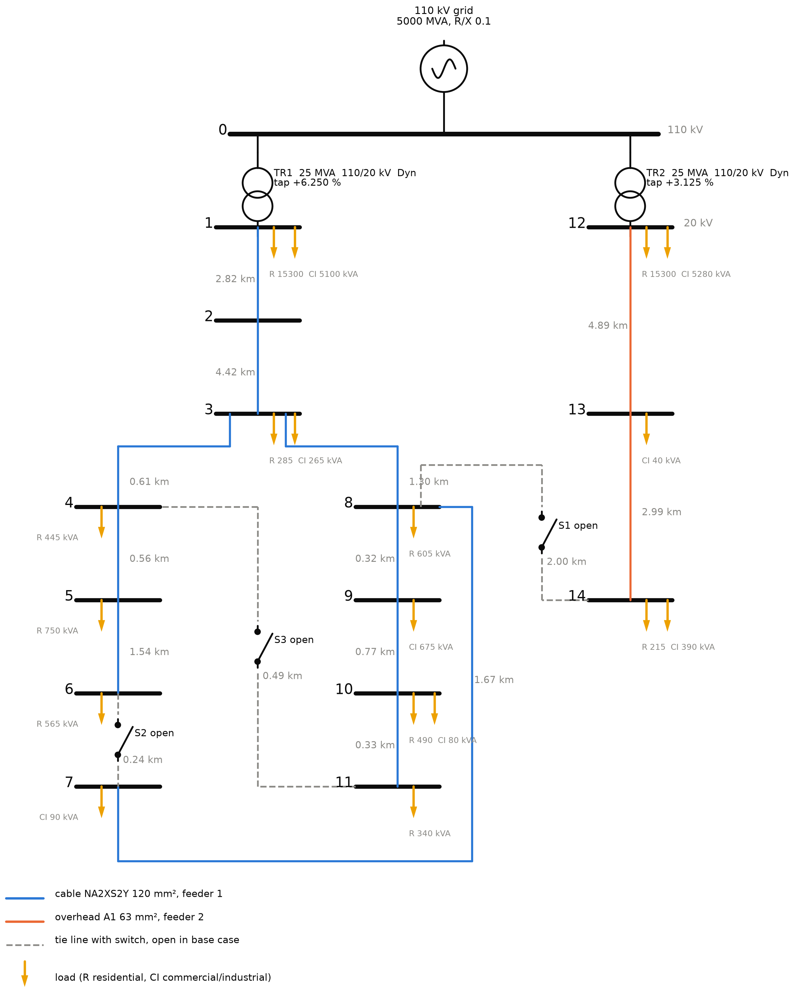
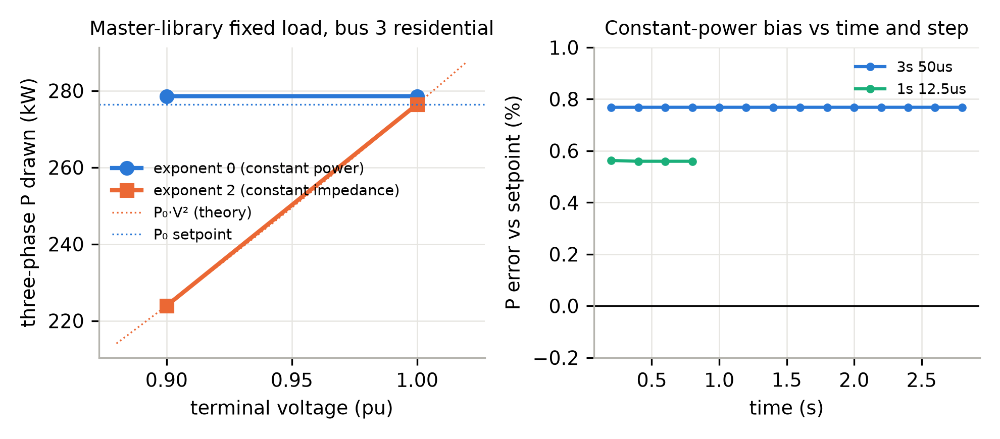
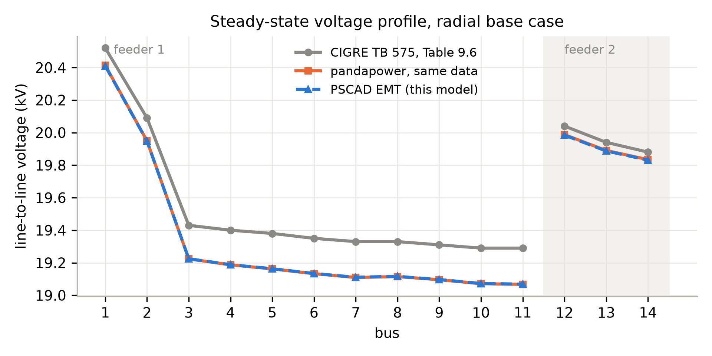
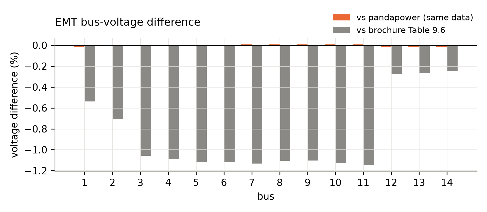
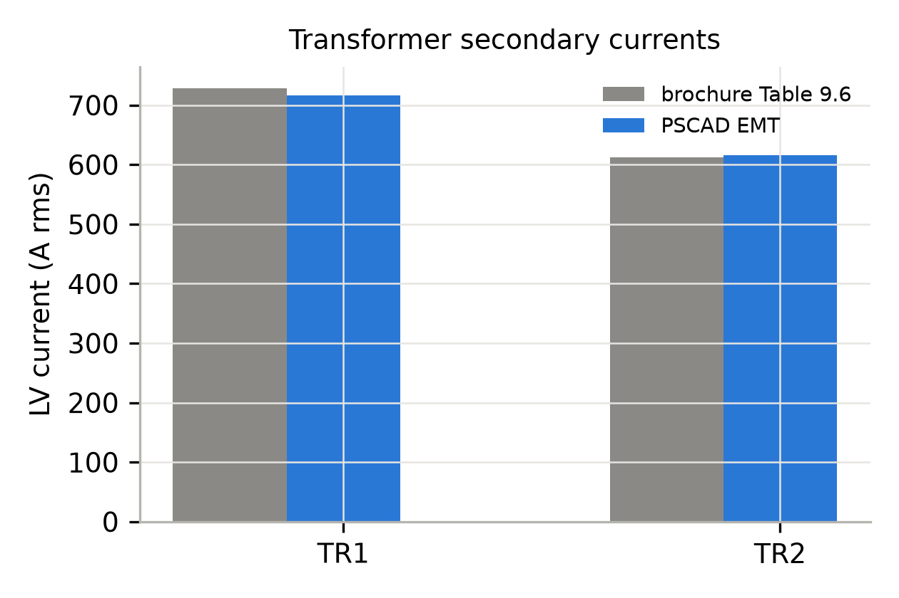
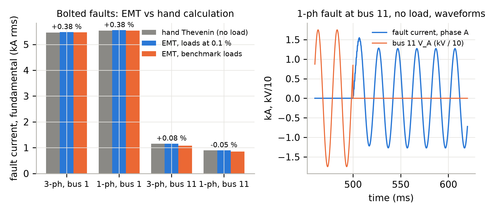
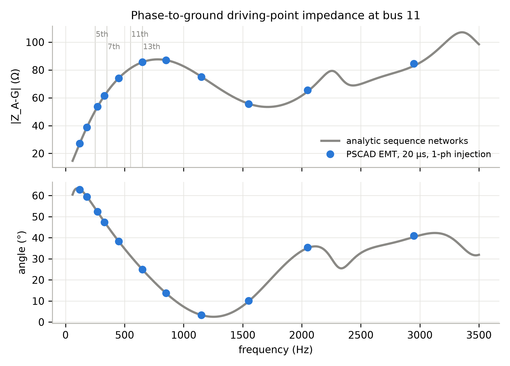
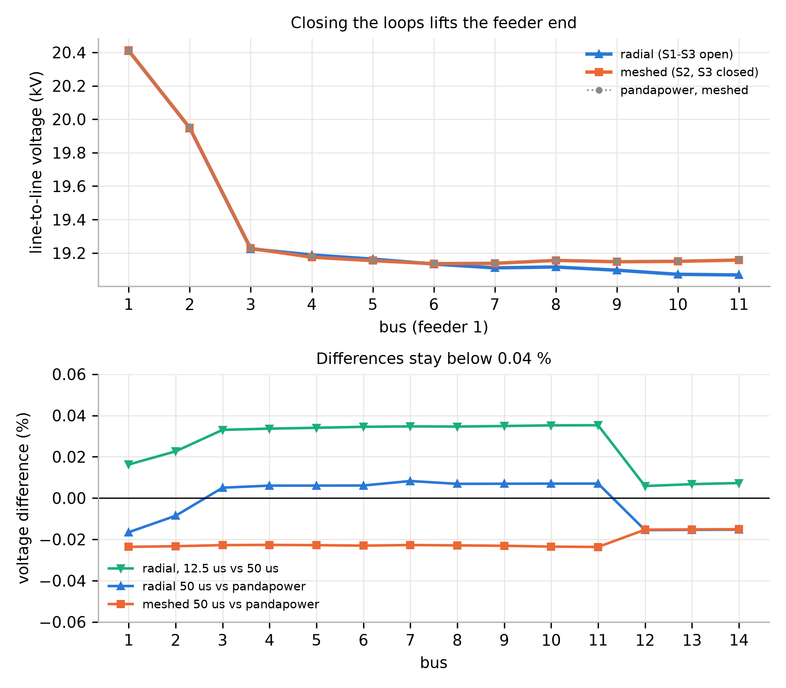
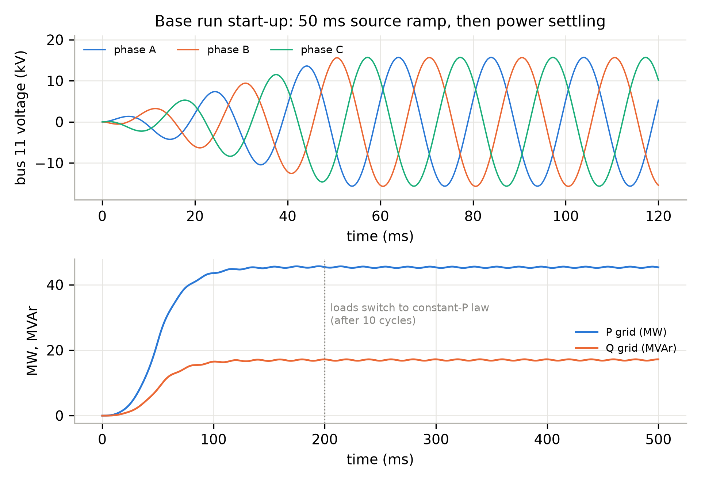

# CIGRE-MV-PSCAD: an open PSCAD implementation of the CIGRE European medium-voltage benchmark network for electromagnetic transient studies

<table class="byline" align="center"><tr>
<td align="center" valign="top"><b>Panas Bhattarai</b> panas.bhattarai@equagen.com acpanasbhattarai@gmail.com</td>
<td align="center" valign="top"><b>Rabindra Maharjan</b> rabindra.maharjan@equagen.com</td>
</tr></table>

September 2026. Version 1.0. Licence BSD-3-Clause.

## Abstract

The CIGRE European medium-voltage (MV) distribution benchmark of Technical Brochure 575 is a standard test network for studies of distributed generation, hosting capacity and power quality. This paper presents CIGRE-MV-PSCAD, an implementation of the benchmark in PSCAD/EMTDC 5 for electromagnetic transient (EMT) simulation. The model is built exclusively from master-library components, so it opens in any licensed PSCAD installation without custom code, and it is generated by a script from a data file in which every value carries the page of the brochure it was taken from. The supply is represented explicitly by a 110 kV grid equivalent and two 25 MVA delta-star transformers with the tap positions used in the brochure's reference power flow; the fifteen line segments are coupled PI sections with the brochure's positive- and zero-sequence data; the three tie switches are breakers; the loads are master-library fixed loads set to constant power. The model is validated at four levels. Bus voltages agree with a load flow of the same data to 0.02 %, and with the brochure's own reference table to 1.2 %, the latter arising entirely from two modelling conventions used in the brochure's own calculation - transformer impedance not referred through the tapped ratio, and constant-impedance loads - which when reproduced recover Table 9.6 to 0.032 %. Three-phase and single-phase short-circuit currents at the feeder head and feeder end agree with hand calculation to 0.4 %. A phase-to-ground impedance scan from 120 Hz to 3 kHz agrees with an analytic sequence-network reference to 0.5 % up to 1.5 kHz. A time-step check and a meshed configuration complete the set. The paper documents the modelling choices the brochure leaves open, the behaviour of the master-library constant-power load, and two practical findings on PSCAD exports that affect any post-processing of EMT results.

**Keywords:** CIGRE benchmark, medium-voltage distribution, electromagnetic transients, PSCAD, EMTDC, open model, validation, hosting capacity.

## 1. Introduction

Benchmark networks let researchers compare methods on a common footing. For distribution systems with distributed energy resources (DER), the networks defined by CIGRE Task Force C6.04.02 in Technical Brochure 575 [1], first described for the MV case by Rudion et al. [2], have become the reference set, alongside the IEEE radial test feeders [3]. Open implementations of the CIGRE MV network exist for steady-state tools such as pandapower [4] and OpenDSS [5].

Electromagnetic transient (EMT) simulation [6, 7] is the tool of choice when the question involves inverter controls, faults, switching, harmonics or resonance, all of which are central to the integration of photovoltaic and other inverter-based resources at MV level. The benchmark has been used in EMT and real-time tools for individual studies, for instance fault location in PSCAD/EMTDC [16] and microgrid stability on a real-time platform [17]. An EMT model needs more than a load-flow model: explicit transformers with vector group and grounding, lines with zero-sequence data, loads with a defined voltage dependence, and a source with an impedance. The brochure provides some of this and leaves the rest to the user.

This paper presents CIGRE-MV-PSCAD, an implementation of the European MV benchmark in PSCAD/EMTDC version 5 [8], with three properties:

- **Master-library only.** Every element is a standard PSCAD component. There is no custom component, no compiled code and no external library, so the model opens, runs and can be modified in any licensed PSCAD 5.0.2 or later installation.
- **Generated from data.** A Python script builds the model through PSCAD's automation library from a data file in which every parameter carries its source page in the brochure. The model can be regenerated, audited and extended by editing data rather than schematics.
- **Validated at four levels.** Steady state against an independent load flow and against the brochure's reference table, short-circuit currents against hand calculation, frequency-domain impedance against an analytic sequence-network model, and consistency across time step and switch configuration.

Section 2 describes the benchmark and the data. Section 3 describes the implementation and the choices the brochure leaves open. Section 4 presents the validation. Section 5 discusses limits.

## 2. The CIGRE European MV benchmark

### 2.1 Network

Figure 1 shows the network as implemented. Two 25 MVA, 110/20 kV transformers feed two 20 kV feeders from a common 110 kV bus (bus 0). Feeder 1 (buses 1 to 11) is an underground cable feeder, 15.07 km in total, with two internal loops that can be closed by switches S2 (6-7) and S3 (11-4). Feeder 2 (buses 12 to 14) is an overhead feeder, 7.88 km, connected to feeder 1 through switch S1 (14-8). In the radial base case all three switches are open. Loads are specified at twelve buses as residential and commercial/industrial apparent power and power factor; buses 1 and 12 carry large lumped loads representing other feeders on the same transformers.

### 2.2 Data and their sources

All parameters were transcribed from the brochure [1] into a machine-readable data file, `data/cigre_mv_european_tb575.json`, with the PDF page of each value recorded. Table 1 summarises what the brochure specifies. The 2006 paper [2] was used as a cross-check: line lengths, bus numbering, load buses and switch locations agree; the paper's per-segment line constants and its per-unit load values on an unstated base were not used.

*Table 1. Data provided by TB 575 for the European MV network.*

| Item | Brochure data |
|---|---|
| Nominal voltage, frequency | 20 kV, 50 Hz; 110 kV upstream |
| HV grid equivalent | 5000 MVA short-circuit power, R/X = 0.1 |
| Transformers | 2 × 25 MVA, 110/20 kV, Dyn1, 0.016 + j1.92 Ω referred to 20 kV (0.1 % + j12 %); on-load tap changer on the LV side; reference power flow at +6.25 % (TR1) and +3.125 % (TR2) |
| Line types | Cable NA2XS2Y 120 mm²: R1 0.501, X1 0.716 Ω/km, B1 47.49 µS/km; R0 0.817, X0 1.598 Ω/km, B0 47.49 µS/km. Overhead A1 63 mm²: R1 0.510, X1 0.366 Ω/km, B1 3.17 µS/km; R0 0.658, X0 1.611 Ω/km, B0 1.28 µS/km. Conductor geometry is also given. |
| Segments | 15, lengths 0.24 to 4.89 km |
| Loads | Apparent power and power factor per bus and sector, coincidence factors already applied; daily profiles as figures |
| Reference results | Table 9.6: bus voltages and branch currents for the radial case with the taps above |

Three things the brochure does not provide matter for an EMT model and are discussed in Section 3: the load's voltage dependence, the transformer's magnetising branch and neutral treatment, and the zero-sequence impedance of the upstream grid.

### 2.3 Consistency of the published data, and of the published method

Before building the EMT model, the data file was used to build the network in pandapower 3.5 [4] and the result was compared with the brochure's Table 9.6. Two observations shape everything that follows.

First, the reference table can only be reproduced with the transformer taps at the positions stated in the brochure's Table 9.7 and with bus 0 held at 110 kV. Without the taps the voltages are about 8 % low.

Second, with the taps applied, the load flow of the published data differs from the published table by up to 1.05 % at the feeder-1 end, and the difference grows along the feeder. It is insensitive to the stiffness of the 110 kV source and to the transformer resistance, and it worsens if line capacitance is neglected. The gap is not an error in the data. It is the product of two modelling conventions in the brochure's own calculation:

1. **The transformer impedance is not referred through the tapped ratio.** The brochure states 12 % on a 110/20 kV base and then applies a tap. If the 12 % is held in per-unit on the *untapped* base, so that the tap acts only on the ideal ratio, the ohmic impedance seen from the 20 kV side is 1.92 ohm, against 2.17 ohm when it is referred through the tapped ratio as PSCAD, pandapower and a hand calculation do.
2. **The loads are constant impedance, not constant power.**

Table 2 gives the load flow of the published data under each combination of the two conventions, computed by `scripts/tb575_conventions.py`. With both of the brochure's conventions adopted, Table 9.6 is reproduced to **0.032 %** at all fifteen buses and the transformer secondary currents to 0.006 %. The two effects are separable: the tap convention contributes a near-uniform offset of about 0.6 % along each feeder, and the load model contributes the along-feeder slope. TB 575 is therefore internally self-consistent to about 0.05 %, and the roughly 1 % gap belongs to the brochure's *method*, not to its data.

*Table 2. Worst bus-voltage error of the published data against Table 9.6, buses 1 to 14, for the four combinations of transformer-tap convention and load model.*

| Transformer impedance | Load model | Worst error | Error at bus 1, bus 11 |
|---|---|---|---|
| referred through tapped ratio | constant power | 1.05 % | -0.48 %, -1.05 % |
| referred through tapped ratio | constant impedance | 0.55 % | -0.53 %, -0.53 % |
| held on untapped base | constant power | 0.39 % | +0.09 %, -0.39 % |
| held on untapped base | constant impedance | 0.032 % | -0.01 %, 0.00 % |

The consequence for this work is that an implementation adopting the modern conventions, impedance referred through the tap and constant-power loads, should expect about 1 % disagreement with Table 9.6, and that figure is used below as the tolerance for the brochure comparison. Exact agreement is instead checked against the pandapower load flow of the same data. The convention choice is not merely cosmetic. It is worth about 0.6 % on bus voltages but **12.3 % on feeder-head fault current**, 5.458 kA against 6.130 kA for a three-phase fault at bus 1 with loads ignored, so a study that inherits the brochure's convention without noticing will misstate short-circuit duty by far more than it misstates voltage.

## 3. Implementation in PSCAD

### 3.1 Overview

The model is a single PSCAD project, `CIGRE_MV_PSCAD.pscx`, generated by `scripts/build_cigre_mv.py` through the mhi.pscad automation library that ships with PSCAD. Electrical connections are made with node labels BUS_0 to BUS_14, so the canvas is a regular grid of four regions: supply and transformers, the line list, one measurement and load station per bus, and the recorders. Table 3 lists the components.

*Table 3. Components of CIGRE-MV-PSCAD (all PSCAD master library).*

| Element | Component | Settings |
|---|---|---|
| 110 kV grid | `source3R` | 110 kV base, 5000 MVA, 0.2408 + j2.408 Ω, EMF 110.48 kV (Section 3.2) |
| Transformers TR1, TR2 | `xfmr-3p2w` | 25 MVA, 110/20 kV, delta HV, star LV with solidly grounded neutral, Xl 0.12 pu, copper loss 0.001 pu, no saturation; secondary rated voltage 21.25 kV (TR1) and 20.625 kV (TR2) to represent the fixed taps |
| Lines, 15 | `newpi`, coupled PI | R, L, C per metre from the sequence data, 50 Hz |
| Switches S1, S2, S3 | `breaker3` | In series with segments 15, 6 and 11; state from a constant on the canvas, 1 = open |
| Loads | `fixed_load`, one per phase and sector | P and Q from S and pf, rated 11.547 kV L-G, voltage exponents NP = NQ = 0, 10 cycles before release |
| Bus stations | `breakout`, `voltmetergnd` | Three line-to-ground voltmeters per bus |
| Recording | `pgb` | 45 bus phase voltages, 6 transformer LV currents, grid P and Q |

Simulation settings are 50 µs time step, 1 s duration and output every step; both are parameters of the build script.

### 3.2 Supply

The 110 kV grid is a three-phase voltage source behind the brochure's 5000 MVA equivalent. The brochure's reference power flow holds bus 0 at exactly 110 kV as a slack bus. With the equivalent impedance in front of it, the Thevenin EMF must therefore be slightly higher than 110 kV under benchmark load; a value of 110.48 kV gives 110.00 kV at bus 0 and is entered as a named constant on the canvas.

The transformers are the classical three-phase two-winding model with delta HV and star LV windings. The star point is solidly grounded, which the brochure does not specify but which is the usual assumption for a benchmark with symmetric loads. The on-load taps used in the brochure's reference power flow are represented by the secondary rated voltage, 20 kV × 1.0625 for TR1 and 20 kV × 1.03125 for TR2; the leakage impedance is referred through the tapped ratio, as pandapower does for a tap on the LV side.

The phase shift deserves a note. The brochure's Table 9.6 shows the 20 kV side leading the 110 kV side by 30 degrees (bus 1 at +23.66 degrees with bus 0 at 0). An IEC Dyn1 connection would be a 30 degree lag. The model follows the brochure's table so that angles as well as magnitudes can be compared; one setting on each transformer, "Delta lags or leads Y", changes it.

### 3.3 Lines

Each segment is a coupled PI section with the brochure's positive- and zero-sequence resistance, inductance and capacitance per unit length. A lumped PI section is the correct EMT representation here: at 50 µs a travelling-wave model needs a line longer than one travel time, about 15 km for overhead and 8 km for cable, and no segment of the benchmark exceeds 4.9 km. The PI representation is accurate to a few per cent up to about 2 kHz for these lengths [10], which Section 4.3 confirms, and it is exact at power frequency.

Because the brochure gives the zero-sequence data explicitly, they are entered rather than estimated. This matters for single-phase faults and for any unbalanced study.

### 3.4 Loads

The brochure gives each load as apparent power and power factor, which is complete for a load flow and incomplete for EMT. A load flow holds P and Q constant regardless of voltage; a physical load does not, and the choice of representation is known to affect dynamic results materially [11, 12, 13]. The benchmark's intended behaviour, as far as it is defined, is therefore constant power at the reference operating point, and that is what the model implements by default.

The PSCAD master-library fixed load takes P, Q and two voltage exponents, and represents the load as an impedance that is updated from the measured voltage so that P = P0 (V/V0)^NP and Q = Q0 (V/V0)^NQ. Exponent 2 is constant impedance, which is the component's default; exponent 0 is constant power. Figure 2 shows the behaviour of a single load, with the bus 3 residential values, in a standalone test at 1.0 and 0.9 pu terminal voltage. With exponent 2 the drawn power follows V² exactly. With exponent 0 the drawn power is the same at both voltages, as required, but 0.77 % above the setpoint at 50 µs and 0.56 % above it at 12.5 µs. The bias is present from the first cycle and constant for 3 s, so it is not a settling effect; equal bias on P and Q points to a small offset in the component's internal voltage measurement. It is documented rather than corrected, and it shifts the feeder voltages by about 0.1 %.

Each sector at each bus is one fixed load per phase, so unbalanced loading only requires editing three values. The component starts as a constant impedance and switches to its exponent law after ten cycles, which is visible in Figure 9.

Constant impedance is the more usual choice for switching, fault and harmonic studies, where the load's voltage dependence matters more than matching a table. Setting both exponents to 2 on every load converts the model, and Section 4.3 uses that setting.

### 3.5 Measurements and recorders

Each bus has a phase breakout and three line-to-ground voltmeters. The transformer LV phase currents and the grid P and Q are taken from the components' own outputs. All 53 signals are recorded to file at every step, which produces about 30 MB per second of simulation at 50 µs.

### 3.6 Reproducibility

The build script reads the data file, creates the project, places every component, sets every parameter and wires every connection through the automation library, then saves the project. The run takes three to five minutes because it makes about 600 remote calls; running the finished model takes 12 s per simulated second. A validation script then reads the PSCAD exports, fits fundamental phasors by least squares over the last 200 ms, and compares them with a pandapower load flow built from the same data file and with the brochure table. Everything in Section 4 is produced by the scripts in the repository from the data file.

## 4. Validation

### 4.1 Steady state

Figure 3 compares the bus voltages of the EMT model, of the pandapower load flow of the same data with the loads scaled by the 1.0077 constant-power bias of Section 3.4, and of the brochure's Table 9.6. Figure 4 shows the differences bus by bus.

The EMT model and the load flow agree to 0.017 % at the worst bus, and the voltage angles agree to 0.01 degrees. Without the bias scaling the worst difference is 0.10 %, entirely attributable to the load component. Against the brochure table the worst difference is 1.15 % at the end of feeder 1, the same size and the same along-feeder pattern as the difference between the published data and the published table discussed in Section 2.3. The phase unbalance of the EMT result is 0.02 %.

Figure 5 compares the transformer secondary currents with the brochure. TR1 carries 716.6 A against 727.9 A in the table and TR2 615.9 A against 612.2 A, within 1.5 % and 0.6 %.

### 4.2 Short-circuit currents

Bolted three-phase and single-phase-to-ground faults were applied at bus 1, the head of feeder 1, and at bus 11, its end, using the master-library timed fault component with 0.001 Ω fault resistance. The fault current fundamental was fitted over 0.7 to 0.8 s, after the DC offset had decayed. The reference is a hand Thevenin calculation with the same definitions: EMF 110.48 kV behind the grid equivalent, referred through the tapped transformer ratio, transformer impedance at the tapped voltage, and line impedances summed along the radial path 1-2-3-8-9-10-11. For the single-phase fault the delta HV winding blocks the upstream zero-sequence path, so Z0 is the transformer plus the line zero-sequence impedance and the current is 3E / |2 Z1 + Z0|. Loads and line capacitance are ignored, as in IEC 60909 practice [9].

Figure 6 shows the result. With the loads reduced to 0.1 % of their value, the four cases agree with the hand calculation within 0.4 %, which confirms the positive-, negative- and zero-sequence impedances of the source, both transformers and the lines. With the benchmark loads connected, the feeder-head faults are unchanged, but the feeder-end fault currents are 5 to 7 % lower, because the loads on buses 3 to 10 lie between the source and the fault and take current. This is physical; the IEC method ignores it by convention, an EMT model does not, and users comparing with IEC results should disconnect the loads as done here. The first peak of the feeder-head fault current is about 14 kA.

### 4.3 Frequency scan

The phase-A-to-ground driving-point impedance at bus 11 was measured by connecting a 1 kV single-phase source behind 2000 Ω between phase A and ground, so that about 0.7 A is injected at the test frequency on top of normal operation, and fitting V and I at that frequency by least squares with the 50 Hz component fitted simultaneously. Eleven frequencies from 120 to 2950 Hz were run at a 20 µs step with all loads set to exponent 2, so that the network is linear. The reference is an analytic model built from the same data file: positive- and zero-sequence nodal admittance matrices with lumped PI lines, transformer leakage, the grid equivalent in positive sequence only, loads as parallel R and L sized at 20 kV, and the open tie lines kept as dangling PI sections connected at their bus end, exactly as in the PSCAD model. The phase-to-ground impedance is (2 Z1 + Z0) / 3.

Figure 7 shows agreement in magnitude within 0.5 % up to 1550 Hz and within 1.8 % at 2950 Hz, and in angle within 0.6 degrees throughout. The feeder shows a first series resonance near 1.25 kHz and a first parallel resonance calculated at about 4.6 kHz, which places the cable feeder's resonances well above the harmonics of most inverters. The residual above 2 kHz is consistent with trapezoidal integration at 20 µs and with the lumped PI representation.

Two practical points were learned in this test. PSCAD writes a source's current channel one time step after the voltage channels, so any impedance or power computed from exported waveforms must advance the current by one sample; before that correction the angle was off by 360·f·Δt degrees, up to 22 degrees at 3 kHz. And an open switch does not remove the tie line's capacitance: a first version of the reference that omitted the three open lines disagreed by up to 8 % near 1.4 kHz.

### 4.4 Time step and meshed configuration

Figure 8 compares the radial case at 12.5 µs with the 50 µs result and shows the meshed case with S2 and S3 closed. The 12.5 µs run differs from the load flow by 0.018 % at the worst bus against 0.017 % at 50 µs, so 50 µs is adequate for fundamental-frequency work; 12.5 to 20 µs is recommended for harmonic or switching studies. Closing the two loops raises the feeder-1 end voltage from 19.07 to 19.16 kV, and the meshed EMT result agrees with the corresponding load flow within 0.024 %. Switch states are changed by setting two constants on the canvas.

### 4.5 Start-up

Figure 9 shows the first 500 ms of the base run: the source ramps up over 50 ms, the grid power settles within 100 ms, and the loads change from constant impedance to their constant-power law at 200 ms with no visible disturbance. The model is at steady state well before the 800 ms window used for the measurements above.

## 5. Discussion and limitations

**Scope of the validation.** The four levels together show that the model reproduces the benchmark's power-frequency operating point, its sequence impedances, and its frequency response up to about 2 kHz, from a single data file with no tuning other than the source EMF that fixes the slack voltage. The one systematic deviation, 1 % against the brochure table, belongs to the brochure's calculation conventions (Section 2.3), not to its data.

**Modelling assumptions.** The transformer core is ideal, with no magnetising current or saturation; the LV star points are solidly grounded; the zero-sequence impedance of the 110 kV equivalent equals its positive-sequence value; the loads are balanced and have no dynamics beyond the component's release logic. None of these is specified by the brochure. Each is a parameter of the model and can be changed by users who need it.

**Unvalidated phenomena.** The model is not validated for inrush and saturation transients, arc and breaker phenomena, unbalanced load-flow results, or behaviour above about 2 kHz, where lumped PI sections lose accuracy. Those are the natural next steps for anyone extending the model.

**Load representation.** Constant power is the benchmark-faithful choice and the shipped default; constant impedance is the EMT-conventional choice and is one parameter away. The 0.6 to 0.8 % bias of the master-library load in constant-power mode is small, stable and documented. Users who need exact constant power can replace the loads with a controlled-current implementation, at the cost of custom code.

**Relationship to CIGRE and to MHI.** This is an independent implementation of the published benchmark, with the parameters presented in the authors' own tables and the diagram redrawn. It is not a CIGRE publication and CIGRE has not reviewed it; the brochure itself is copyrighted and is not redistributed. PSCAD is a product of Manitoba Hydro International; a licensed copy is required, and no part of the software or its libraries is redistributed.

## Data and code availability

The PSCAD model, the data file with its page references, the scripts that build and validate the model, the validation results and the figures are available at https://github.com/panas-bhattarai/CIGRE-MV-PSCAD under the BSD-3-Clause licence. Version 1.0 of the repository corresponds to this paper.

## References

[1] CIGRE Task Force C6.04.02, *Benchmark Systems for Network Integration of Renewable and Distributed Energy Resources*, Technical Brochure 575, CIGRE, Paris, April 2014.

[2] K. Rudion, A. Orths, Z. A. Styczynski and K. Strunz, "Design of benchmark of medium voltage distribution network for investigation of DG integration," *IEEE Power Engineering Society General Meeting*, Montreal, 2006, doi:10.1109/PES.2006.1709447.

[3] W. H. Kersting, "Radial distribution test feeders," *IEEE Power Engineering Society Winter Meeting*, vol. 2, pp. 908-912, 2001.

[4] L. Thurner, A. Scheidler, F. Schäfer, J.-H. Menke, J. Dollichon, F. Meier, S. Meinecke and M. Braun, "pandapower: An open-source Python tool for convenient modeling, analysis, and optimization of electric power systems," *IEEE Transactions on Power Systems*, vol. 33, no. 6, pp. 6510-6521, Nov. 2018.

[5] R. C. Dugan and T. E. McDermott, "An open source platform for collaborating on smart grid research," *IEEE Power and Energy Society General Meeting*, Detroit, 2011.

[6] H. W. Dommel, "Digital computer solution of electromagnetic transients in single- and multiphase networks," *IEEE Transactions on Power Apparatus and Systems*, vol. PAS-88, no. 4, pp. 388-399, April 1969.

[7] J. Mahseredjian, V. Dinavahi and J. A. Martinez, "Simulation tools for electromagnetic transients in power systems: Overview and challenges," *IEEE Transactions on Power Delivery*, vol. 24, no. 3, pp. 1657-1669, July 2009.

[8] Manitoba Hydro International Ltd., *PSCAD/EMTDC version 5.0.2* and *Getting Started with PSCAD v5.0.2*, Winnipeg, Canada, 2023. https://www.pscad.com

[9] IEC 60909-0:2016, *Short-circuit currents in three-phase AC systems, Part 0: Calculation of currents*, International Electrotechnical Commission, Geneva, 2016.

[10] N. Watson and J. Arrillaga, *Power Systems Electromagnetic Transients Simulation*, 2nd ed., IET, London, 2018.

[11] IEEE Task Force on Load Representation for Dynamic Performance, "Load representation for dynamic performance analysis," *IEEE Transactions on Power Systems*, vol. 8, no. 2, pp. 472-482, May 1993.

[12] CIGRE Working Group C4.605, *Modelling and Aggregation of Loads in Flexible Power Networks*, Technical Brochure 566, CIGRE, Paris, February 2014.

[13] A. Arif, Z. Wang, J. Wang, B. Mather, H. Bashualdo and D. Zhao, "Load modeling: A review," *IEEE Transactions on Smart Grid*, vol. 9, no. 6, pp. 5986-5999, Nov. 2018.

[14] IEEE Std 1547-2018, *IEEE Standard for Interconnection and Interoperability of Distributed Energy Resources with Associated Electric Power Systems Interfaces*, IEEE, 2018.

[15] EN 50160:2010, *Voltage characteristics of electricity supplied by public electricity networks*, CENELEC, Brussels, 2010.

[16] M. Abad, M. García-Gracia, N. El Halabi and D. López Andía, "Network impulse response based-on fault location method for fault location in power distribution systems," *IET Generation, Transmission & Distribution*, vol. 10, no. 15, pp. 3962-3970, 2016, doi:10.1049/iet-gtd.2016.0765.

[17] A. Gkountaras, T. Sezi and S. Dieckerhoff, "Real time simulation and stability evaluation of a medium voltage hybrid microgrid," *7th IET International Conference on Power Electronics, Machines and Drives (PEMD 2014)*, Manchester, 2014, doi:10.1049/cp.2014.0490.
